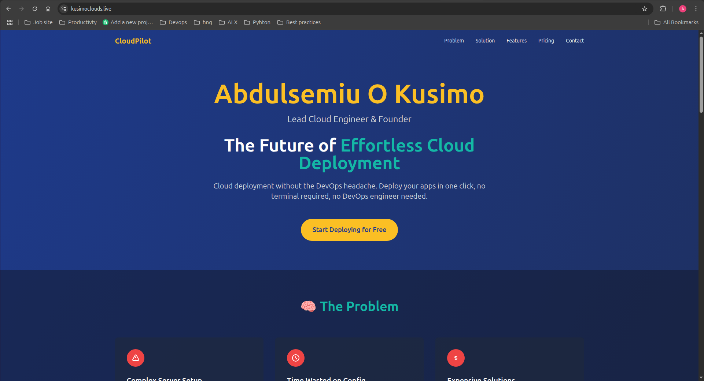

# AltSchool Africa Tinyuka - Cloud Engineering Second Semester Project

## Project Title: The Future of Service-Based Scheduling

**Name**: Abdulsemiu Kusimo
**AltSchool ID**: ALT/SOE/024/2392
**School**: AltSchool Africa Tinyuka
**Track**: Cloud Engineering

---

## Project Overview

This project demonstrates the provisioning of a cloud-based Ubuntu server, configuration of Nginx as a reverse proxy, deployment of a dynamic Node.js web application, and optional SSL encryption. It showcases my ability to manage server infrastructure, secure networking, and modern deployment practices—all designed to simulate a startup-grade prototype.

---

## Project Objectives

* Provision a cloud server
* Configure a production-grade web server (Nginx)
* Deploy a dynamic landing page using Node.js
* Secure the application with HTTPS via Certbot (bonus)
* Use a custom domain: **kusimoclouds.live**

---

## 1. Server Provisioning

### Steps:

* **Cloud Provider**: AWS EC2
* **Instance Type**: t2.micro (Free Tier)
* **OS**: Ubuntu 22.04 LTS
* **Security Group Rules**:

  * Port 22 (SSH)
  * Port 80 (HTTP)
  * Port 443 (HTTPS)

### SSH Access:

```bash
chmod 400 aws_key.pem
ssh -i aws_key.pem ubuntu@13.60.40.74
```

---

## 2. Web Server Setup

### Commands:

```bash
sudo apt update && sudo apt upgrade -y
sudo apt install nginx -y
```

### Reverse Proxy to Node.js App:

**Config File:** `/etc/nginx/sites-available/node_app.conf`

```nginx
server {
    listen 80;
    server_name kusimoclouds.live;

    location / {
        proxy_pass http://localhost:3000;
        proxy_http_version 1.1;
        proxy_set_header Upgrade $http_upgrade;
        proxy_set_header Connection 'upgrade';
        proxy_set_header Host $host;
        proxy_cache_bypass $http_upgrade;
    }
}
```

Enable the site:

```bash
sudo ln -s /etc/nginx/sites-available/node_app.conf /etc/nginx/sites-enabled/
sudo nginx -t
sudo systemctl restart nginx
```

---

## 3. Dynamic Landing Page

**Project Title**: The Future of Service-Based Scheduling

### Pitch:

DropSlot empowers local service providers with smart, AI-backed booking pages. Whether you're a tutor, barber, or tailor, DropSlot makes scheduling seamless and efficient for your clients.

### Professional Bio:

I’m a backend engineer and cloud enthusiast with experience in Node.js, Express, MongoDB, and AWS. I’ve worked on several portfolio and real-world projects involving server deployment, reverse proxies, and CI/CD workflows.

### Frontend:

* Node.js with Express
* TailwindCSS for styling
* Basic animations for interactivity

---

## 4. Networking & Security

* **Ports Opened**: 80 (HTTP), 443 (HTTPS)
* **SSL Certificate**:

```bash
sudo apt install certbot python3-certbot-nginx -y
sudo certbot --nginx -d kusimoclouds.live -d www.kusimoclouds.live
```

* Auto-renewal:

```bash
sudo certbot renew --dry-run
```

---

## Public Access

* **Public IP**: `13.60.40.74`
* **Domain**: [https://kusimoclouds.live](https://kusimoclouds.live)

---

## Screenshots

![Landing Page Screenshot] 

---

## Contact

**Email**: [abdulsemiu.kusimo@gmail.com](mailto:abdulsemiu.kusimo@gmail.com)
**LinkedIn**: [linkedin.com/in/abdulsemiu-kusimo](https://linkedin.com/in/abdulsemiu-kusimo)

---


